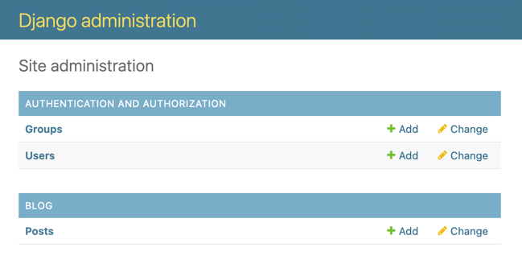

# Adding Models to the Administration Site

Let’s add your blog models to the administration site. 

```python
from django.contrib import admin
from .models import Post

admin.site.register(Post)
```

Now reload the administration site in your browser. You should see your Post model on the site, as follows:



That was easy, right? When you register a model in the Django administration site, you get a user-friendly interface generated by introspecting your models that allows you to list, create, edit and
delete objects in a simple way.