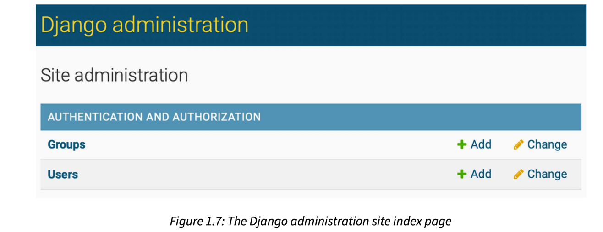

# Administration Site for Models

Django comes with a built-in administration interface that is very useful for editing content.

## Creating a superuser

First, you will need to create a user to manage the administration site. Run the following command:

```shell
python manage.py createsuperuser
```

Enter your desired username, email, and password.

Then you will see the following success message:

```
Superuser created successfully.
```

We just created an administrator user with the highest permissions.

Open http://127.0.0.1:8000/admin/ in your browser. You should see the administration login page.

Log in using the credentials of the user you created in the preceding step. You will see the administration site index page.



The **Group** and **User** models that you can see in the preceding screenshot are part of the Django authentication framework located in **django.contrib.auth**. If you click on Users, you will see the user
you created previously.