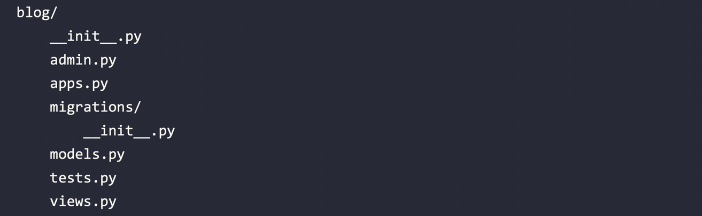

# Creating a Django Application

Run the following command in the shell prompt from the project’s root directory:

```shell
python manage.py startapp blog
```



These files are as follows: 

• __init__.py: An empty file that tells Python to treat the blog directory as a Python module.

 • admin.py: This is where you register models to include them in the Django administration site—using this site is optional. 

• apps.py: This includes the main configuration of the blog application. 

• migrations: This directory will contain database migrations of the application. Migrations allow Django to track your model changes and synchronize the database accordingly. This directory contains an empty __init__.py file.

 • models.py: This includes the data models of your application; all Django applications need to have a models.py file but it can be left empty. 

• tests.py: This is where you can add tests for your application. 

• views.py: The logic of your application goes here; each view receives an HTTP request, processes it, and returns a response. 

With the application structure ready, we can start building the data models for the blog.