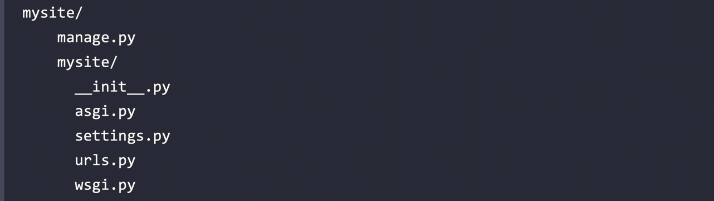

# Creating a Django Project

Django provides a command that allows you to create an initial project file structure. Run the following
command in your shell prompt:

```Shell
django-admin startproject mysite
```

This will create a Django project with the name mysite.

>  you can put a dot at the end of the command to place project manage.py and stuff in current directory.

> Avoid naming projects after built-in Python or Django modules in order to avoid conflicts.

Let’s take a look at the generated project structure:

