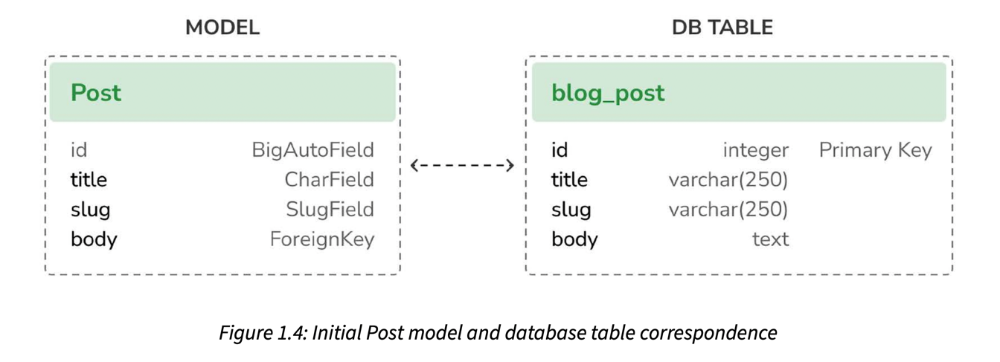

# Creating a Post Model

## Model to DB

Let’s take a look at how the model and its fields will be translated into a database table and columns. The following diagram shows the Post model and the corresponding database table that Django will create when we synchronize the model to the database:

Django will create a database column for each of the model fields: title, slug, and body. You can see how each field type corresponds to a database data type. 

By default, Django adds an auto-incrementing primary key field to each model. The field type for this field is specified in each application configuration or globally in the DEFAULT_AUTO_FIELD setting. When creating an application with the startapp command, the default value for DEFAULT_AUTO_FIELD is BigAutoField. This is a 64-bit integer that automatically increments according to available IDs. 

If you don’t specify a primary key for your model, Django adds this field automatically. You can also define one of the model fields to be the primary key by setting primary_key=True on it. 

We will expand the Post model with additional fields and behaviors. Once complete, we will synchronize it to the database by creating a database migration and applying it.

## datetime fields

Each post will be published at a specific date and time. Therefore, we need a field to store the publication date and time. We also want to store the date and time when the Post object was created, and when it was last modified.

By using auto_now_add, the date will be saved automatically when creating an object and By using auto_now, the date will be updated automatically when saving an object.

## str Method

We have also added a __str__() method to the model class. This is the default Python method to return a string with the human-readable representation of the object. Django will use this method to display the name of the object in many places, such as the Django administration site.