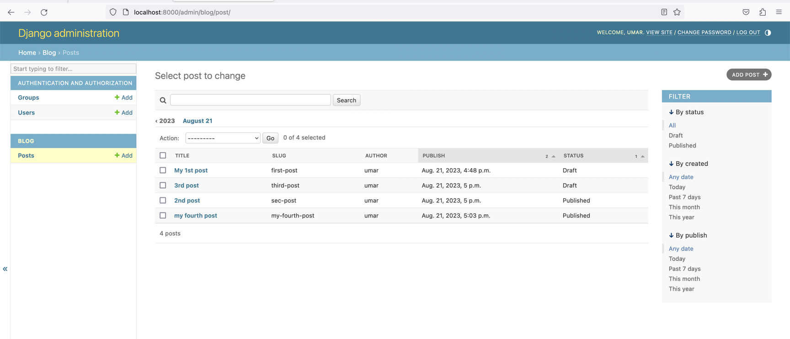
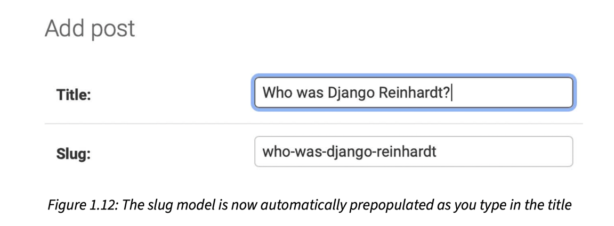
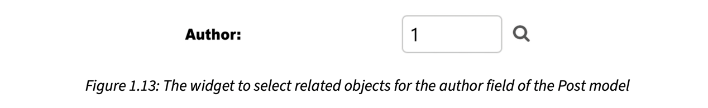

# Customizing How Models are Displayed

Now, we will take a look at how to customize the administration site.

Edit the admin.py file of your blog application and change it, as follows

```python
from django.contrib import admin
from .models import Post

@admin.register(Post)
class PostAdmin(admin.ModelAdmin):
    list_display = ['title', 'slug', 'author', 'publish', 'status']
    list_filter = ['status', 'created', 'publish', 'author']
    search_fields = ['title', 'body']
    date_hierarchy = 'publish'
    ordering = ['status', 'publish']
    prepopulated_fields = {
        'slug': ('title',)
    }
    raw_id_fields = ['author']
```

We are telling the Django administration site that the model is registered in the site using a custom class that inherits from **ModelAdmin**. In this class, we can include information about how to display the model on the site and how to interact with it. 

The @admin.register() decorator performs the same function as the admin.site.register() function.

Return to your browser and reload the post list page. Now, it will look like this:



- The **list_display** attribute allows you to set the fields of your model that you want to display on the administration object list page. 
- The list page now includes a right sidebar that allows you to filter the results by the fields included in the **list_filter** attribute.
- A search bar has appeared on the page. This is because we have defined a list of searchable fields using the **search_fields** attribute.
- Just below the search bar, there are navigation links to navigate through a date hierarchy; this has been defined by the **date_hierarchy** attribute.
- You can also see that the posts are ordered by STATUS and PUBLISH columns by default. We have specified the default sorting criteria using the **ordering** attribute.
- Next, click on the ADD POST link. You will also note some changes here. As you type the title of a new post, the slug field is filled in automatically. You have told Django to prepopulate the slug field with the input of the title field using the **prepopulated_fields** attribute:



- Also, the author field is now displayed with a lookup widget, which can be much better than a dropdown select input when you have thousands of users. This is achieved with the raw_id_fields attribute and it looks like this:



With a few lines of code, we have customized the way the model is displayed on the administration site. There are plenty of ways to customize and extend the Django administration site; you will learn more about this later. 

You can find more information about the Django administration site at https://docs.djangoproject. com/en/4.1/ref/contrib/admin/.